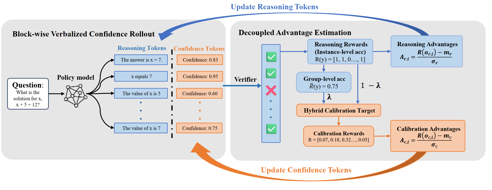
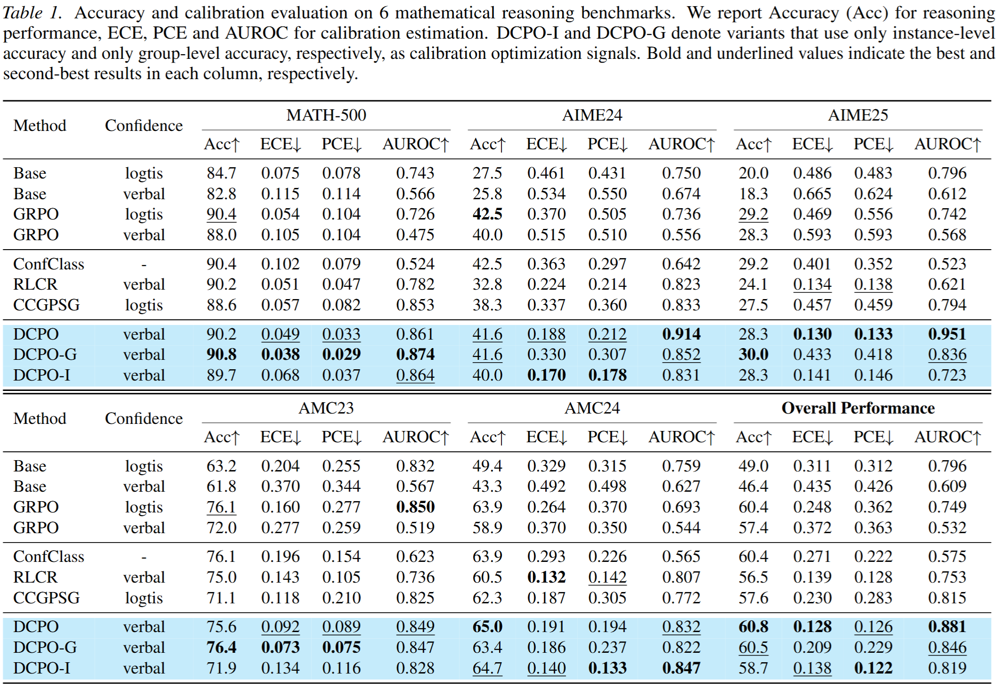

# 🚀 DCPO  
## Decoupling Reasoning and Confidence in RL from Verifiable Rewards

Official implementation of:

> **Decoupling Reasoning and Confidence: Resurrecting Calibration in Reinforcement Learning from Verifiable Rewards**  

<p align="center">
  
</p>

---

## 🔎 Motivation

Reinforcement Learning from Verifiable Rewards (RLVR), such as **Group Relative Policy Optimization (GRPO)**, significantly improves LLM reasoning.

However, we show that:

> ⚠️ RLVR makes models severely over-confident.

During training:
- Confidence steadily increases
- Over-confidence (PCE) worsens
- Calibration error remains large

Existing calibration-aware RL methods reduce miscalibration, but usually hurt reasoning accuracy due to gradient interference.

---

## 💡 Our Solution: DCPO

**DCPO (Decoupled Calibration Policy Optimization)** separates:

- 🧠 Reasoning optimization  
- 📊 Confidence calibration  

at the token level.

### Key idea

- Seperate reasoning tokens and confidence tokens
- Apply **accuracy reward** to reasoning tokens  
- Apply **calibration reward** to confidence tokens  
- Use masked gradients to avoid interference  

This simple decoupling eliminates the accuracy–calibration conflict.

---

## 📊 Results

Evaluated on:

- MATH-500  
- AIME 2024 / 2025  
- AMC 2023 / 2024  

Base model: **Qwen3-8B**

<p align="center">
  
</p>

## Environment Setup

The code has been successfully tested on **8 × 80GB A100 GPUs** with **CUDA 12.8**.  
To create a Conda environment, run the following commands:

```bash
git clone https://github.com/mazhengzhao/DCPO.git
cd DCPO
conda env create -f environment.yml
```
---

## Running the Code

After setting up the environment, run the following command to start training:

```bash
bash examples/Qwen3-8B.sh
```

---

## Evaluating Metrics

To compute evaluation metrics such as **Accuracy**, **Expected Calibration Error (ECE)**, **Brier Score (BS)** and **Positive Calibration Error (PCE)**, deploy a vllm service of your model, 

```bash
bash examples/eval.sh
```

identify your model name and service url and run:

```bash
bash examples/eval.sh
```

The script will log output in folder logs/$model_name/ and plot a calibration curve in Figs/{model_name}.

---
## 🙏 Acknowledgements

This repository builds upon the following open-source projects, to which we are deeply grateful:
[verl](https://github.com/volcengine/verl), [AR-Lopti](https://github.com/zhyang2226/AR-Lopti), [LogicRL](https://github.com/Unakar/Logic-RL), [DeepScaleR](https://github.com/agentica-project/rllm), [AdaRFT](https://github.com/limenlp/verl), [CCGSPG](https://github.com/HaotianLiu123/CCGSPG)
